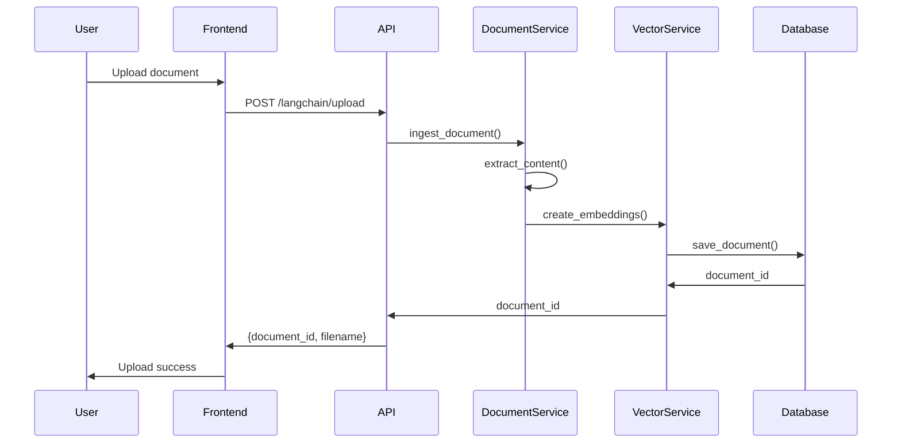
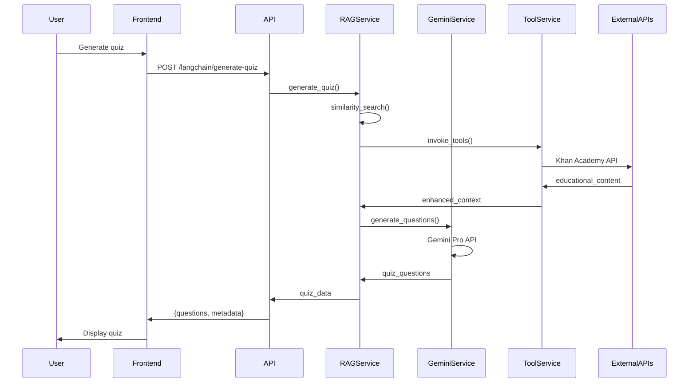
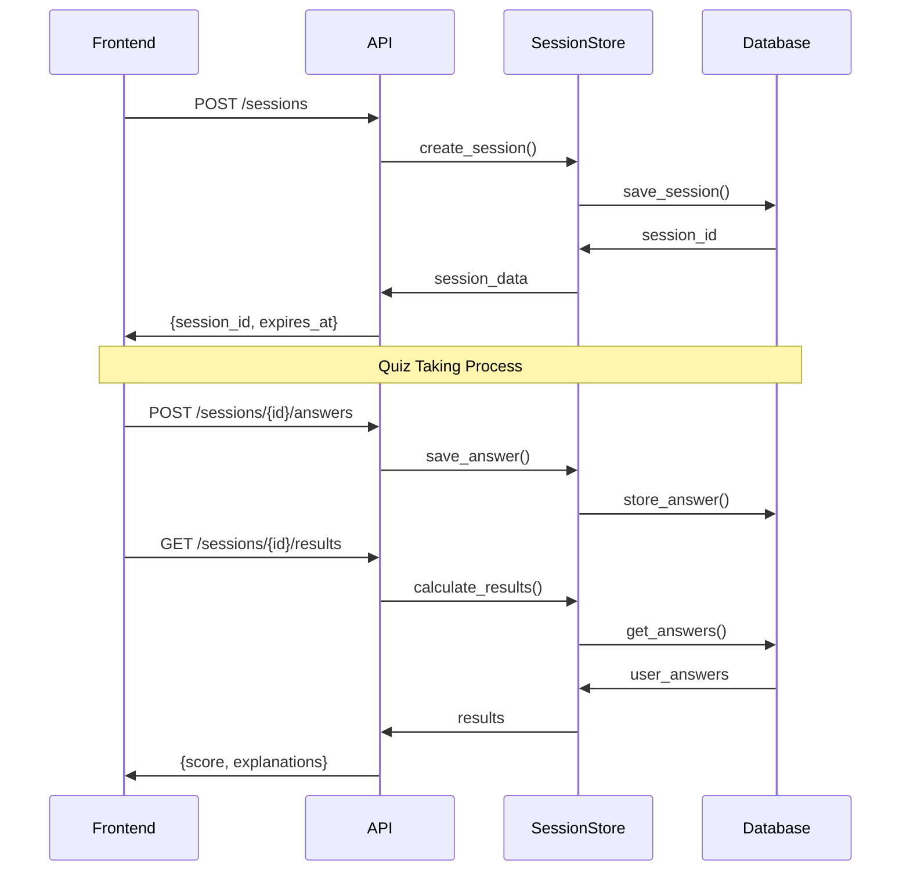
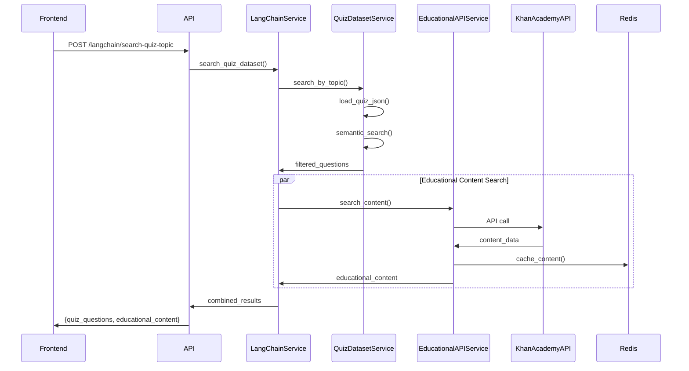
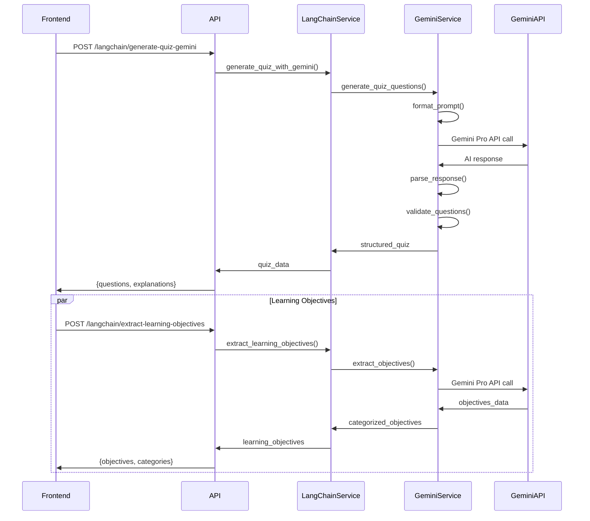
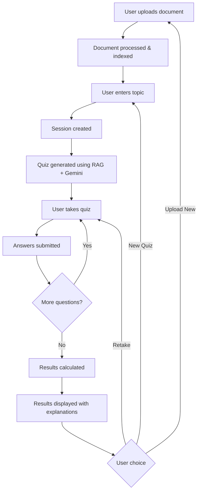
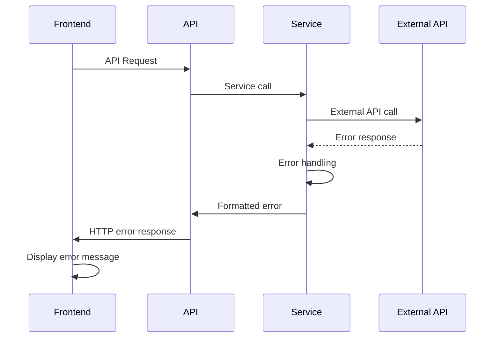

# Quiz Generator Application Flow

This document describes the complete flow of the Quiz Generator application, detailing what happens in the background when each endpoint is called, including the specific APIs and functions that are invoked.

## Overview

The Quiz Generator follows a multi-layered architecture with the following components:
- **Frontend**: React TypeScript application
- **Backend**: FastAPI with multiple services
- **Database**: SQLite for persistence
- **Cache**: Redis for performance
- **External APIs**: Google Gemini Pro, Khan Academy
- **Tools**: LangChain tool calling system

## Core Application Flow

### 1. Document Upload Flow

**Endpoint**: `POST /langchain/upload`

**What happens in the background:**
1. Frontend sends file via FormData
2. FastAPI receives multipart/form-data
3. DocumentIngestionService processes the file
4. File is saved to backend/uploads/
5. Document content is extracted and chunked
6. Vector embeddings are generated
7. Document metadata is stored in database
8. Document ID is returned to frontend

**Function Call Chain:**
```
Frontend (DocumentUpload.tsx) 
→ apiClient.uploadDocument() 
→ POST /langchain/upload 
→ upload_document() in routes.py
→ DocumentIngestionService.ingest_document()
→ VectorIndexingService.create_embeddings()
→ Database.save_document_metadata()
→ Return document_id
```



### 2. Quiz Generation Flow

**Endpoint**: `POST /langchain/generate-quiz`

**What happens in the background:**
1. Frontend sends topic, question_count, difficulty
2. RAG service retrieves relevant document chunks
3. LangChain tools are invoked for additional context
4. Gemini service generates quiz questions
5. Questions are formatted and validated
6. Quiz data is returned to frontend

**Function Call Chain:**
```
Frontend (App.tsx) 
→ apiClient.generateQuiz() 
→ POST /langchain/generate-quiz 
→ generate_quiz() in routes.py
→ LangChainRAGService.generate_quiz()
→ VectorIndexingService.similarity_search()
→ GeminiService.generate_quiz_questions()
→ Return quiz_data with questions
```




### 3. Session Management Flow

**Endpoint**: `POST /sessions`

**What happens in the background:**
1. Frontend sends document_id, topic, metadata
2. Session is created with unique session_id
3. Session data is stored in database
4. Session expiration is set
5. Session object is returned to frontend

**Function Call Chain:**
```
Frontend (App.tsx) 
→ apiClient.createSession() 
→ POST /sessions 
→ create_session() in routes.py
→ Database.create_session()
→ Return session data
```



### 4. Quiz Dataset Search Flow

**Endpoint**: `POST /langchain/search-quiz-topic`

**What happens in the background:**
1. Frontend sends topic search query
2. QuizDatasetService loads quiz_questions.json
3. Semantic search is performed on questions
4. Results are filtered by topic relevance
5. Matching questions are returned

**Function Call Chain:**
```
Frontend 
→ apiClient.searchQuizByTopic() 
→ POST /langchain/search-quiz-topic 
→ search_quiz_by_topic() in routes.py
→ LangChainRAGService.search_quiz_dataset()
→ QuizDatasetService.search_by_topic()
→ Return filtered questions
```

### 5. Educational Content Search Flow

**Endpoint**: `GET /langchain/educational-content`

**What happens in the background:**
1. Frontend sends search query
2. EducationalAPIService queries Khan Academy API
3. Results are cached in Redis
4. Content is formatted and returned
5. Fallback topics are provided if needed

**Function Call Chain:**
```
Frontend 
→ apiClient.getEducationalContent() 
→ GET /langchain/educational-content 
→ get_educational_content() in routes.py
→ LangChainRAGService.get_educational_content()
→ EducationalAPIService.search_content()
→ Khan Academy API call
→ Redis cache storage
→ Return educational content
```



## Phase 10 - Gemini Integration

### 6. Gemini Quiz Generation Flow

**Endpoint**: `POST /langchain/generate-quiz-gemini`

**What happens in the background:**
1. Frontend sends generation parameters
2. GeminiService formats the prompt
3. Google Gemini Pro API is called
4. Response is parsed and validated
5. Structured quiz questions are returned

**Function Call Chain:**
```
Frontend 
→ apiClient.generateQuizWithGemini() 
→ POST /langchain/generate-quiz-gemini 
→ generate_quiz_with_gemini() in routes.py
→ LangChainRAGService.generate_quiz_with_gemini()
→ GeminiService.generate_quiz_questions()
→ Google Gemini Pro API call
→ Response parsing and validation
→ Return structured quiz
```

### 7. Learning Objectives Extraction Flow

**Endpoint**: `POST /langchain/extract-learning-objectives`

**What happens in the background:**
1. Frontend sends document content
2. GeminiService processes the text
3. Learning objectives are extracted using AI
4. Objectives are categorized and formatted
5. Structured objectives are returned

**Function Call Chain:**
```
Frontend 
→ apiClient.extractLearningObjectives() 
→ POST /langchain/extract-learning-objectives 
→ extract_learning_objectives() in routes.py
→ LangChainRAGService.extract_learning_objectives_with_gemini()
→ GeminiService.extract_learning_objectives()
→ Google Gemini Pro API call
→ Text processing and categorization
→ Return learning objectives
```



## Complete User Journey Flow

### End-to-End Quiz Taking Process

1. **Document Upload** → User uploads educational document
2. **Processing** → Document is processed and indexed
3. **Topic Input** → User enters desired topic/objective
4. **Session Creation** → Quiz session is created
5. **Quiz Generation** → Questions are generated using RAG + Gemini
6. **Quiz Taking** → User answers questions interactively
7. **Answer Submission** → Each answer is submitted and stored
8. **Results Generation** → Final results are calculated and displayed





## API Response Formats

### Document Upload Response
```json
{
  "document_id": 123,
  "filename": "educational_document.pdf",
  "status": "processed",
  "chunks_created": 45,
  "embeddings_generated": true
}
```

### Quiz Generation Response
```json
{
  "quiz_data": {
    "questions": [
      {
        "id": 1,
        "question": "What is photosynthesis?",
        "question_type": "multiple_choice",
        "options": ["A", "B", "C", "D"],
        "correct_answer": "A",
        "explanation": "Detailed explanation..."
      }
    ],
    "metadata": {
      "topic": "Biology",
      "difficulty": "medium",
      "generated_by": "gemini"
    }
  }
}
```

### Session Response
```json
{
  "session_id": "uuid-string",
  "created_at": "2024-01-01T00:00:00Z",
  "expires_at": "2024-01-01T01:00:00Z",
  "status": "active",
  "document_id": 123,
  "topic": "Photosynthesis"
}
```

## Error Handling Flow

### Error Types and Responses
1. **Document Upload Errors** → File validation, processing failures
2. **Quiz Generation Errors** → LLM API failures, context retrieval issues
3. **Session Errors** → Expired sessions, invalid session IDs
4. **External API Errors** → Khan Academy API failures, Gemini API issues

### Error Flow


## Performance Optimizations

### Caching Strategy
- **Redis Cache**: Educational content, quiz questions, embeddings
- **Database Indexing**: Session lookup, document retrieval
- **Frontend Caching**: API responses, user session data

### Background Processing
- **Document Ingestion**: Async processing of large documents
- **Vector Generation**: Batch embedding creation
- **Cache Warming**: Preload frequently accessed data

This comprehensive flow documentation provides a complete understanding of how the Quiz Generator application works internally, making it easier for developers to understand, debug, and extend the system. 